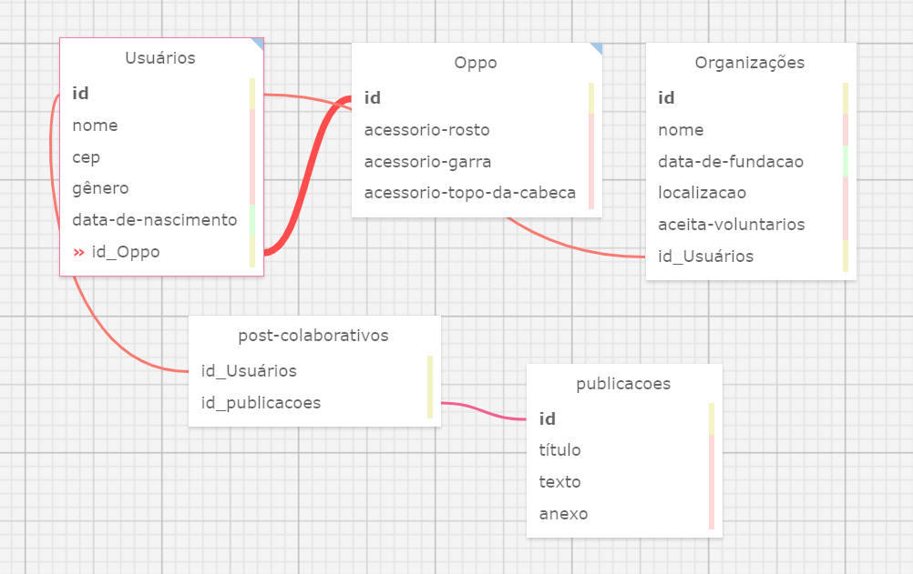

# atividade-3-semana

## Banco de Dados

&nbsp;&nbsp;&nbsp;&nbsp;Bancos de dados são sistemas que armazenam os dados de uma aplicação. Ele é escolhido de acordo com as necessidades de escalabilidade, desempenho e consistência (FILHO, 2002).<br>

### Modelo relacional

&nbsp;&nbsp;&nbsp;&nbsp;A modelagem conceitual é a primeira etapa na criação de um banco de dados para um software. Nessa fase, identificam-se os tipos de dados a serem armazenados e representa-se visualmente a estrutura. Abaixo, podemos visualizar a elaboração do modelo relacional para o projeto:<br>

<div align="center">

<sub>Figura 1 - Diagrama do banco de dados</sub>



<sup>Fonte: Material produzido pelo autor (2024)</sup>

</div>

&nbsp;&nbsp;&nbsp;&nbsp;No banco de dados elaborado, foram feitas cinco tabelas contendo, por padrão, uma chave primária *id*, com excessão da tabela "post-colaborativos".<br>

#### Tabela de Usuários:

&nbsp;&nbsp;&nbsp;&nbsp;Iniciando-se a análise pela tabela de usuários, temos o `id`, o identificador da conta de um usuário, que será responsável por armazenar os dados do público da plataforma. Assim, é nesse espaço que iremos encontrar, além da sua chave primária, os campos de preenchimento: `nome`, `cep`, `gênero`, `data de nascimento`. Para essa criação, suponhamos que a conta pode ser facilmente acessada por nome e não irá possuir um sistema de e-mail e senha. Além disso, o usuário também carrega a chave primária do `Oppo`, personagem personalizável da plataforma que terá seu ID de personalização.<br>

Relações:<br>

- **Usuários para Oppo (1:1):** Um usuário pode ter um estilo de personalização de um Oppo.<br>
- **Usuário para publicações (N:N):** Por meio de uma tabela `post-colaborativos`, vários usuários podem participar ao mesmo tempo de várias publicações. Esse estilo de planilha foi baseado nas postagens colaborativas da plataforma Instagram.<br>
- **Usuário para Organizações (1:N):** Um usuário pode ter várias organizações registradas em seu perfil</br>

#### Tabela do Oppo:

&nbsp;&nbsp;&nbsp;&nbsp;Seguindo para a tabela de personalizações do mascote da plataforma, o Oppo, tem-se o armazenamento dos registros de todas as customizações do carangueijo, separados entre os ids `acessorio_rosto`, `acessorio-garra` e `acessorio-topo-da-cabeca`, representando diferentes tipos de personalizações.<br>

Relações:<br>

- **Usuários para Oppo (1:1):** Uma personalização de um Oppo pode ter um usuário<br>

#### Tabela de Organizações:

&nbsp;&nbsp;&nbsp;&nbsp;Na tabela de organizações, temos o `id`, o identificador de uma organização específica, que será responsável por armazenar os dados daquela Organização da Sociedade Civil da plataforma. Assim, é nesse espaço que iremos encontrar, além da sua chave primária, os campos de preenchimento: `nome`, `data-de-fundacao`, `localizacao`, o booleano se ela aceita voluntários ou não `aceita-voluntarios`, e também recebe como chave estrangeira o `id-usuários` do usuário que criou a página daquela organização. <br>

Relações:<br>

- **Organizações para Usuários (1:1):** Uma organização pode ter só um usuário por vez</br>

#### Tabela de Publicações:

&nbsp;&nbsp;&nbsp;&nbsp;A tabela de publicações é responsável por armazenar os dados das publicações feitas na plataforma, incluindo o `titulo`, o `texto` e a presença de algum `anexo`, como uma imagem. <br>

Relações:<br>

- **Publicações para usuários (N:N):** Por meio de uma tabela `post-colaborativos`, várias publicações podem pertencer ao mesmo tempo de várias perfis de usuários. Esse estilo de planilha foi baseado nas postagens colaborativas da plataforma Instagram.<br>

#### Tabela de Publicações colaborativas:

&nbsp;&nbsp;&nbsp;&nbsp;Essa tabela recebe duas chaves estrangeiras para vincular publicações colaborativas de vários usuários, estabelecendo uma relação N:N. Ela recebe o ID de Usuários e o ID das publicações.<br>

&nbsp;&nbsp;&nbsp;&nbsp;Abaixo, é possível visualizar uma explicação linha a linha a respeito da criação do banco de dados em SQL:<br>

```sql
-- Tabela "usuarios": Armazena informações sobre os usuários do sistema.
CREATE TABLE Usuários (
    id SERIAL PRIMARY KEY, -- Identificador da conta de um usuário
    nome VARCHAR(200) NOT NULL, -- Nome do usuário, não pode ser nulo
    cep VARCHAR NOT NULL, -- CEP do usuário, não pode ser nulo
    gênero VARCHAR NOT NULL, -- Gênero do usuário, não pode ser nulo
    data_de_nascimento DATE NOT NULL, -- Data de nascimento do usuário, não pode ser nula
    id_Oppo INTEGER REFERENCES Oppo(id) -- Chave estrangeira referenciando a tabela Oppo, o mascote personalizado da plataforma
);
		
--Tabela "Oppo", armazena informações a respeito da personalização do mascote da plataforma
CREATE TABLE Oppo (
    id SERIAL PRIMARY KEY, -- Identificador da tabela Oppo
    acessorio-rosto text NULL, -- Acessório para o rosto, pode ser nulo pois simboliza que a skin está padrão
    acessorio-garra text NULL, -- Acessório de garra, pode ser nulo pois simboliza que a skin está padrão
    acessorio-topo-da-cabeca text NULL -- Acessório para o topo da cabeça, pode ser nulo pois simboliza que a skin está padrão
);
	
--Tabela "Organizações", armazena informações a respeito das organizações disponíveis na plataforma
CREATE TABLE Organizações (
    id SERIAL PRIMARY KEY, -- Identificador da tabela Organizações
    nome VARCHAR(200) NOT NULL, -- Nome da organização, não pode ser nulo
    data_de_fundacao DATE NOT NULL, -- Data de fundação da organização, não pode ser nula
    localizacao VARCHAR NOT NULL, -- Localização da organização, não pode ser nula
    aceita-voluntarios boolean NOT NULL, -- Booleano que indica se a organização aceita voluntários (falso ou verdadeiro), não pode ser nulo
    id_Usuários INTEGER REFERENCES Usuários(id) -- Chave estrangeira referenciando a tabela Usuários
);
		
--Tabela "Publicações", armazena informações a respeito das publicações
CREATE TABLE publicacoes (
    id SERIAL PRIMARY KEY, -- Identificador da tabela publicacoes
    título VARCHAR(400) NOT NULL, -- Título da publicação, não pode ser nulo
    texto text NOT NULL, -- Texto da publicação, não pode ser nulo
    anexo text(500) NULL -- Anexo da publicação, pode ser nulo
);

-- tabela de postagens colaborativas que vários usuários podem ser creditados pela mesma postagem, igual ocorre no instagram.
CREATE TABLE post-colaborativos (
    id_Usuários INTEGER REFERENCES Usuários(id), -- Chave estrangeira referenciando a tabela Usuários
    id_publicacoes INTEGER REFERENCES publicacoes(id) -- Chave estrangeira referenciando a tabela publicacoes
);
```

## Referências

FILHO et al. **Banco de dados relacional para cadastro, avaliação e manejo da arborização em vias públicas**. Revista Árvore, v. 26, p. 629-642, 2002. Acesso em: 02 de mai. 2024.